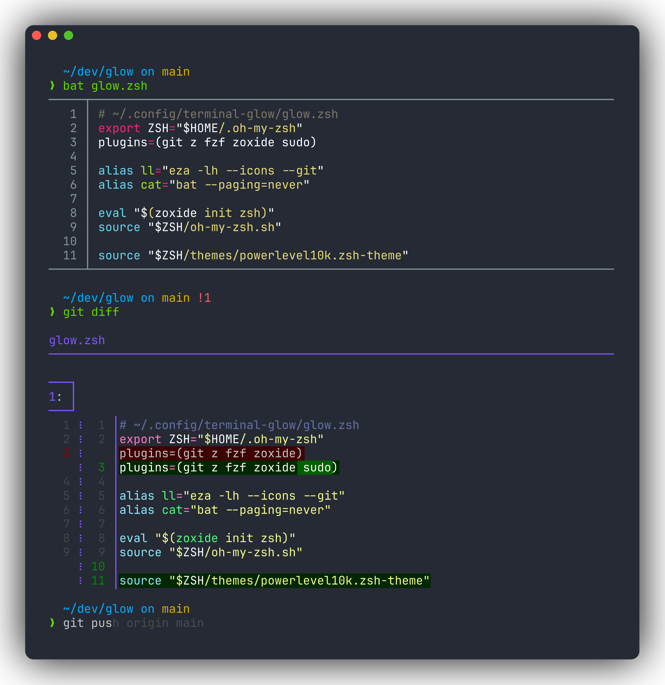

<div align="center">

# ✨ mac-terminal-glow

**一条命令，把 macOS 终端美化成颜值天花板**
**One command to turn your macOS terminal into eye-candy**

iTerm2 · Oh My Zsh · Powerlevel10k · 语法高亮 · 自动建议 · fastfetch · git-delta · tmux

[一键安装](#-一键安装--one-line-install) · [安装内容](#-安装内容--whats-installed) · [设计原则](#-设计原则--design-principles) · [卸载](#-卸载--uninstall)

<br/>



</div>

---

## 🚀 一键安装 / One-line install

```bash
bash <(curl -fsSL https://raw.githubusercontent.com/CatCatUncle/mac-terminal-glow/main/install.sh)
```

> 脚本会自动克隆本仓库并完成全部配置，**幂等可重复运行**。
> The script self-bootstraps (clones this repo) and configures everything. **Idempotent — safe to re-run.**

**服务器 / SSH（无图形界面）/ Headless server (no GUI):**

```bash
bash <(curl -fsSL https://raw.githubusercontent.com/CatCatUncle/mac-terminal-glow/main/install.sh) --no-gui
```

或克隆后本地运行 / Or clone and run locally:

```bash
git clone https://github.com/CatCatUncle/mac-terminal-glow.git
bash mac-terminal-glow/install.sh
```

装完后**新开一个 iTerm 标签页**或执行 `exec zsh` 查看效果。
After install, **open a new iTerm tab** or run `exec zsh` to see it.

---

## 🎨 安装内容 / What's installed

| 组件 / Component | 作用 / What it does |
|---|---|
| **iTerm2** + Meslo Nerd Font | 终端 App + 图标字体，自带 `Terminal Glow ✨` 暗色 Snazzy 配置并设为默认 / Terminal app + icon font, ships a default dark Snazzy profile |
| **Oh My Zsh** + **Powerlevel10k** | 干净的两行提示符（目录 / git / 耗时 / 时间）/ Clean two-line prompt (dir / git / duration / time) |
| **zsh-syntax-highlighting** | 命令对错实时变色 / Commands turn green/red as you type |
| **zsh-autosuggestions** | 灰字历史建议，→ 接受 / Greyed history suggestions, press → to accept |
| **history-substring-search** | ↑↓ 按已输入前缀翻历史 / ↑↓ search history by typed prefix |
| **fastfetch** | 系统信息启动画面（**默认关闭**，保持开终端只有干净提示符；在 `glow.zsh` 里解开注释即可启用）/ System-info splash (**off by default** for a clean prompt; uncomment in `glow.zsh` to enable) |
| **git-delta** | 彩色高亮、带行号的 `git diff` / Beautiful syntax-highlighted diffs |
| **tmux** | 多窗格 + Snazzy 状态栏配置 / Multiplexer with a Snazzy status bar |
| **eza · bat · fzf · zoxide · btop · lazygit · tldr** | 现代 CLI 全家桶 / A modern CLI toolbelt |

### 新命令速查 / New commands

```
ll / la / lt   # 带图标 + git 标记的 ls / icon-rich ls with git markers
z <dir>        # 智能跳转（zoxide）/ jump to frequent dirs
cat / catp     # bat 高亮查看 / syntax-highlighted cat
lg             # lazygit 图形化 git / a gorgeous git TUI
btop           # 漂亮的系统监视器 / pretty system monitor
```

---

## 🛡 设计原则 / Design principles

- **绝不重写你的 `.zshrc`** — 所有逻辑放在 `~/.config/terminal-glow/glow.zsh`，只往 `.zshrc` 追加一行 `source`（带 `# >>> terminal-glow >>>` 标记，幂等）。
  **Never rewrites your `.zshrc`** — logic lives in `~/.config/terminal-glow/glow.zsh`; only one marked `source` line is appended.
- **不强制系统深色模式** — 终端黑底来自 iTerm profile / Terminal Pro 主题，**与系统外观无关**，所以你的 Finder 和浏览器保持原样不变黑。
  **Won't force system dark mode** — terminal darkness comes from the iTerm/Terminal profile, **independent of system appearance**, so Finder & browser stay as-is.
- **已存在的 `~/.p10k.zsh` / `~/.tmux.conf` 不覆盖**，保护你的个人定制。/ Existing `~/.p10k.zsh` / `~/.tmux.conf` are kept.
- **兼容 Intel 与 Apple Silicon**；iTerm 配色自动检测本机 Meslo 字体名生成。/ Works on Intel & Apple Silicon; auto-detects the installed Meslo font.
- 操作前会备份你的 `.zshrc`。/ Backs up your `.zshrc` before touching it.

---

## 🧹 卸载 / Uninstall

```bash
bash uninstall.sh
```

移除 `.zshrc` 接入与 `glow.zsh`（自动备份）。brew 包与 `~/.p10k.zsh` 等保留，需要彻底清理可手动 `brew uninstall`。
Removes the `.zshrc` hook and `glow.zsh` (with backup). Brew packages and dotfiles are left in place — `brew uninstall` them manually if you want a full clean.

---

## 📦 作为 Claude Code Skill 使用 / Use as a Claude Code skill

本仓库本身就是一个 [Claude Code](https://claude.com/claude-code) skill。把它放进 `~/.claude/skills/`（或 symlink），然后对 Claude Code 说「美化我的终端」即可自动调用。
This repo is also a Claude Code skill. Drop it in `~/.claude/skills/` (or symlink it) and just tell Claude Code "beautify my terminal."

```bash
ln -s "$(pwd)/mac-terminal-glow" ~/.claude/skills/mac-terminal-glow
```

---

<div align="center">

## 🐱 私货 / A little plug

**觉得好用？关注【开发者猫叔】，学习更多 AI 知识与开发干货。**
**Like it? Follow _开发者猫叔 (Developer Cat Uncle)_ for more AI & dev know-how.**

用 AI 把每天的工作流玩出花 —— 从终端美化到 Agent 编排，猫叔带你一路升级。
Squeezing AI into everyday workflows — from prettifying your terminal to orchestrating agents.

⭐ 顺手点个 Star 支持一下 / A Star would make Cat Uncle's day.

</div>

---

<sub>MIT License · Made with 🐱 by 开发者猫叔</sub>
